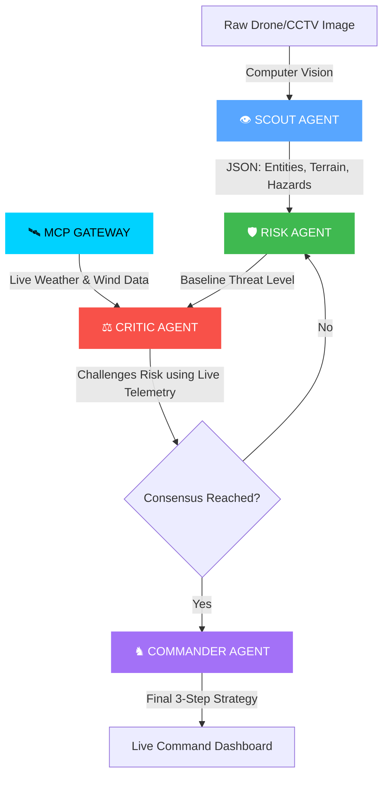
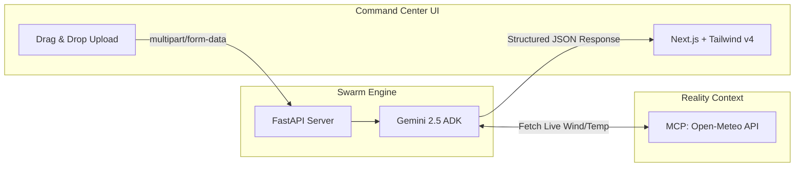

# 🛡️ AEGIS-SWARM
### Autonomous Emergency Ground Intelligence & Swarm Response System

<div align="center">
  
  
  
  
</div>

<br>

> **"Most AI systems answer questions. AEGIS-SWARM coordinates reality."** > An enterprise-grade AI operations command center that transforms raw drone/CCTV visual feeds and live environmental telemetry into a coordinated 3-step action plan within seconds.

---

## 🎥 The Command Center in Action
[](YOUR_YOUTUBE_LINK_HERE)

*soon.. 

---

## 🧠 The 4-Agent Cognitive Pipeline (ADK)

AEGIS-SWARM abandons the traditional "zero-shot LLM" approach. Instead, it utilizes a highly specialized, debating swarm of 4 agents powered by **Gemini 2.5 Flash**.



---

## ⚙️ System Architecture & Deployability

Built on a decoupled, production-ready architecture designed for high-stakes environments.



---

## 🏆 Kaggle Rubric Fulfillment

| Concept | Implementation in AEGIS-SWARM | Status |
| --- | --- | --- |
| **Agent / Multi-Agent System (ADK)** | Custom 4-agent topology (Scout, Risk, Critic, Commander) that debates and reaches consensus. | ✅ |
| **MCP Server / Tool Use** | Live HTTP integration fetching real-time environmental telemetry (Wind Speed, Temperature) to inform the Critic Agent. | ✅ |
| **Deployability** | Enterprise-grade decoupled architecture (FastAPI + Next.js). Codebase is ready for Google Cloud Run containerization. | ✅ |
| **Computer Vision / Spatial Reasoning** | The Scout agent does not rely on text prompts; it extracts spatial reality directly from raw pixels. | ✅ |

---

## 📸 Interface Gallery

---

## 🚀 Local Installation Guide

### Prerequisites

* Python 3.10+
* Node.js 18+
* Google Gemini API Key

### 1. Initialize the Swarm Backend (FastAPI)

```bash
cd CRX_Kaggriculture_Core

# Install Core Dependencies
pip install fastapi uvicorn python-multipart requests python-dotenv google-genai

# Configure Environment
echo "GEMINI_API_KEY=your_gemini_api_key_here" > .env

# Ignite the Server
python server.py

```

*Backend runs on `http://localhost:8000*`

### 2. Initialize the Command Center (Next.js)

```bash
cd aegis-frontend

# Install Dependencies
npm install

# Launch Dashboard
npm run dev

```

*Frontend runs on `http://localhost:3000*`

---

*Built with precision and intensity for the Kaggle Intensive Vibe Coding Capstone.*
