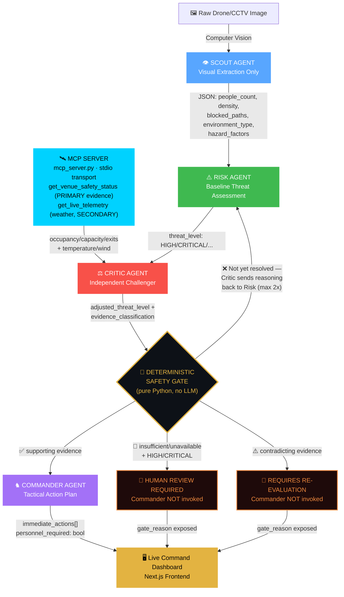
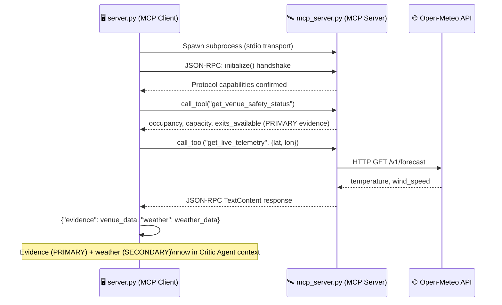
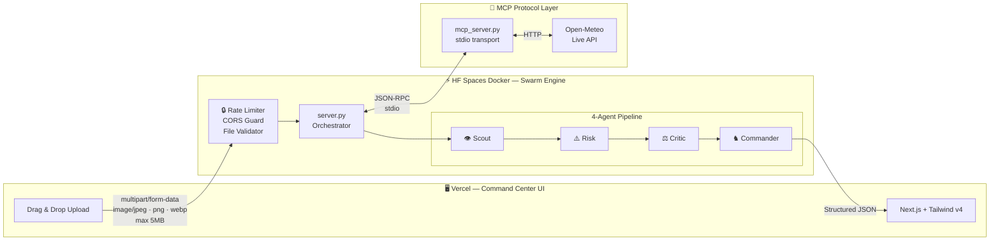
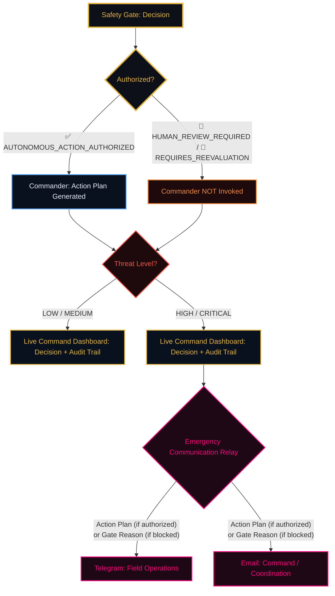

<div align="center">
<h1>⚔️ AEGIS-SWARM</h1>

### The AI That Refuses to Trust Its First Answer.

## One Image. Four Independent Minds. One Trusted Decision.

</div>

<p align="center">

</p>

<p align="center">


</p>

<p align="center">

</p>

> **Most AI systems generate answers. AEGIS-SWARM generates trusted operational decisions.**

AEGIS-SWARM is a custom-built multi-agent orchestration framework for **consensus-driven crowd safety intelligence**. Built for the *Agents for Good* track — because stampedes kill people, and single-model AI is not enough.

Every recommendation is debated, challenged, and checked against independent MCP evidence — then passed through a **deterministic, non-LLM safety gate** that decides whether autonomous action is actually authorized, or whether the case must go to human review instead.

> **AEGIS-SWARM isn't an AI that tries to be smarter than other models. It's an engineering system designed to reduce the risk of acting on a single AI's mistake — through consensus-driven reasoning, independent evidence, and a deterministic checkpoint that no LLM can override.**

📝 *Read the backstory: [Why I Didn't Trust a Single AI Agent — Building AEGIS-SWARM](https://coderudra-x.hashnode.dev/why-i-didn-t-trust-a-single-ai-agent-building-aegis-swarm?utm_source=hashnode&utm_medium=feed)*
---

## 🌐 Live Demo

| Component | Platform | Link |
|---|---|---|
| **Frontend (Command Dashboard)** | Vercel | [aegis-swarm-tan.vercel.app](https://aegis-swarm-tan.vercel.app) |
| **Backend API (Swarm Engine)** | Hugging Face Spaces (Docker) | [coderudra-x-aegis-swarm-backend.hf.space](https://coderudra-x-aegis-swarm-backend.hf.space/api/analyze) |

> ⚠️ **Best experienced on desktop.** The Command 
> Dashboard is optimized for 1280px+ screen width. 
> Mobile browsers may have layout limitations.
> Open on laptop/PC for full experience.

---

## 🎥 The Command Center in Action

[](https://youtu.be/Hn5yP2FG8P4?si=muA6t49xStRKDXZY)

---

## ⚡ Why AEGIS-SWARM Exists

> **Crowd crushes are predictable. Kanjuruhan. Itaewon. Astroworld.**
>
> **They happen because no one trusted the data fast enough.**

Current crowd monitoring is reactive — a human watches a screen, notices a problem too late, and acts too slowly. AEGIS-SWARM makes the pipeline autonomous, multi-perspective, and **consensus-gated**: no action is taken until independent AI agents agree.

Instead of one model's first guess, every recommendation is:

- 👁️ **Observed** — Scout extracts spatial facts directly from raw pixels
- 🧠 **Analyzed** — Risk Agent classifies threat level from structured data
- 📡 **Verified** — Independent MCP evidence (venue occupancy/exits, weather) is gathered — not just visual guesswork
- ⚔️ **Challenged** — Critic Agent independently contests the assessment, weighing that evidence, and classifies it as supporting / contradicting / insufficient / unavailable
- 🔁 **Debated** — If Critic disagrees, Risk re-evaluates with Critic's feedback (iterative loop)
- 🚧 **Gated** — A deterministic, non-LLM Safety Gate checks the threat level against the evidence classification before anything is allowed to act
- 🛡️ **Promoted or Escalated** — Commander generates an action plan only if the gate authorizes it; otherwise the case is routed to human review or re-evaluation

<div align="center">

## **One Image. Four Independent Minds. One Trusted Decision.**

</div>

---

## 🧠 The Cognitive Pipeline — Scout → Risk → Evidence → Critic → Safety Gate → Commander/Human


```mermaid
graph TD
    A["🖼️ Raw Drone/CCTV Image"] -->|Computer Vision| S["👁️ SCOUT AGENT\nVisual Extraction Only"]
    S -->|"JSON: people_count, density,\nblocked_paths, environment_type,\nhazard_factors"| R["⚠️ RISK AGENT\nBaseline Threat Assessment"]

    MCP["🛰️ MCP SERVER\nmcp_server.py · stdio transport\nget_venue_safety_status (PRIMARY evidence)\nget_live_telemetry (weather, SECONDARY)"] -->|"occupancy/capacity/exits\n+ temperature/wind"| C["⚖️ CRITIC AGENT\nIndependent Challenger"]

    R -->|"threat_level: HIGH/CRITICAL/..."| C

    C -->|"adjusted_threat_level +\nevidence_classification"| G{"🚧 DETERMINISTIC\nSAFETY GATE\n(pure Python, no LLM)"}

    G -- "❌ Not yet resolved —\nCritic sends reasoning\nback to Risk (max 2x)" --> R
    G -- "✅ supporting evidence" --> CMD["♞ COMMANDER AGENT\nTactical Action Plan"]
    G -- "🛑 insufficient/unavailable\n+ HIGH/CRITICAL" --> HR["🧍 HUMAN REVIEW REQUIRED\nCommander NOT invoked"]
    G -- "⚠️ contradicting evidence" --> RE["🔁 REQUIRES RE-EVALUATION\nCommander NOT invoked"]

    CMD -->|"immediate_actions[]\npersonnel_required: bool"| UI["🖥️ Live Command Dashboard\nNext.js Frontend"]
    HR -->|"gate_reason exposed"| UI
    RE -->|"gate_reason exposed"| UI

    classDef scout fill:#58a6ff,stroke:#58a6ff,stroke-width:2px,color:#fff;
    classDef risk fill:#3fb950,stroke:#3fb950,stroke-width:2px,color:#fff;
    classDef critic fill:#f85149,stroke:#f85149,stroke-width:2px,color:#fff;
    classDef gate fill:#0d1117,stroke:#e3b341,stroke-width:3px,color:#e3b341;
    classDef cmd fill:#a371f7,stroke:#a371f7,stroke-width:2px,color:#fff;
    classDef human fill:#1e0a0a,stroke:#f0883e,stroke-width:2px,color:#f0883e;
    classDef mcp fill:#00d2ff,stroke:#00d2ff,stroke-width:2px,color:#000;
    classDef ui fill:#e3b341,stroke:#e3b341,stroke-width:2px,color:#000;

    class S scout;
    class R risk;
    class C critic;
    class G gate;
    class CMD cmd;
    class HR,RE human;
    class MCP mcp;
    class UI ui;
```

### Agent Roles — Why Each One Exists

| Component | Role | Why Separate? |
|---|---|---|
| **👁️ Scout** | Visual extraction only — no threat reasoning | Mixing vision + risk in one agent makes reasoning unauditable |
| **⚠️ Risk** | Baseline threat classification (LOW/MEDIUM/HIGH/CRITICAL) | First-pass assessor with no prior assumptions |
| **⚖️ Critic** | Independent challenger using MCP evidence + weather context | Prevents echo-chamber failure — explicitly prompted to disagree, and classifies evidence as supporting/contradicting/insufficient/unavailable |
| **🚧 Safety Gate** | Deterministic (pure Python, zero LLM calls) authorization check | An LLM's own confidence is never sufficient grounds to authorize autonomous action — this checkpoint cannot be argued with, prompted around, or overridden by any agent |
| **♞ Commander** | Tactical action plan — **only runs if the gate authorizes it** | Repositioned as an *action planner*, not the final safety authority |

---

## 📡 The Real MCP Architecture

> **This is not a labeled REST call. This is actual Model Context Protocol.**

Most "MCP integrations" in hackathon projects are just `requests.get()` with "MCP" written in a comment. AEGIS-SWARM implements the real protocol — and exposes **two** tools, not one, because weather alone was never good evidence for crowd-crush risk:


```mermaid
sequenceDiagram
    participant Backend as 🖥️ server.py (MCP Client)
    participant MCP as 🛰️ mcp_server.py (MCP Server)
    participant API as 🌐 Open-Meteo API

    Backend->>MCP: Spawn subprocess (stdio transport)
    Backend->>MCP: JSON-RPC: initialize() handshake
    MCP-->>Backend: Protocol capabilities confirmed
    Backend->>MCP: call_tool("get_venue_safety_status")
    MCP-->>Backend: occupancy, capacity, exits_available (PRIMARY evidence)
    Backend->>MCP: call_tool("get_live_telemetry", {lat, lon})
    MCP->>API: HTTP GET /v1/forecast
    API-->>MCP: temperature, wind_speed
    MCP-->>Backend: JSON-RPC TextContent response
    Backend->>Backend: {"evidence": venue_data, "weather": weather_data}
    Note over Backend: Evidence (PRIMARY) + weather (SECONDARY)\nnow in Critic Agent context
```

**`mcp_server.py`** — Standalone FastMCP server, exposed via `stdio` transport, registered via official `mcp` Python SDK, with two tools:

| Tool | Role | Data |
|---|---|---|
| `get_venue_safety_status()` | **Primary independent evidence** for crowd-crush risk | Occupancy, rated capacity, exits available/total, active incident flag |
| `get_live_telemetry()` | **Secondary** environmental context only — never sufficient on its own | Live temperature/wind from Open-Meteo |

**Honesty about what's real vs. simulated:** `get_live_telemetry()` calls a real live API (Open-Meteo). `get_venue_safety_status()` currently returns clearly-labeled **`SIMULATED`** data (`"data_source": "SIMULATED - no live venue system integrated"`) because no real turnstile/occupancy system is integrated yet — the tool's contract is production-shaped so a real venue API can be dropped in without touching the Critic or the Safety Gate.

**`server.py`** — Acts as MCP client using `ClientSession` + `stdio_client`, performs protocol handshake via `session.initialize()`, calls both tools via `session.call_tool()`, and merges the results into `{"evidence": ..., "weather": ...}` before handing them to the Critic.

This means the telemetry provider is **fully decoupled** — swappable, independently deployable, and reusable by any MCP-compatible host.

---

## 🚧 The Deterministic Safety Gate — No LLM Authorizes Action Alone

> **An LLM's confidence is not evidence. A separate, non-LLM checkpoint decides whether autonomous action is actually allowed.**

Before the gate existed, the Critic (an LLM) could produce a threat level and the very next step (Commander, another LLM) would immediately turn it into an "actionable" plan — including a real Telegram/email dispatch for HIGH/CRITICAL. Nothing checked whether independent evidence actually backed that threat level first.

`agents/safety_gate.py` is **plain Python — no prompt, no model call, no network access.** It reads only two fields the Critic already produced (`adjusted_threat_level`, `evidence_classification`) and applies fixed rules:

| Evidence Classification | Threat Level | Gate Decision | Commander Runs? |
|---|---|---|---|
| `supporting` | any | `AUTONOMOUS_ACTION_AUTHORIZED` | ✅ Yes |
| `insufficient` / `unavailable` | LOW / MEDIUM | `AUTONOMOUS_ACTION_AUTHORIZED` *(gap logged)* | ✅ Yes |
| `insufficient` / `unavailable` | **HIGH / CRITICAL** | `HUMAN_REVIEW_REQUIRED` | ❌ **No — fails closed** |
| `contradicting` | any | `REQUIRES_REEVALUATION` | ❌ No |

The **fail-closed rule** is the core of the design: for genuinely high-stakes situations, the system refuses to let an LLM-authored action plan go out the door on visual reasoning alone when the independent evidence channel couldn't confirm it — it does not pretend confidence it doesn't have.

In code, this is enforced as literal control flow, not a label:

```python
gate_result = evaluate_safety_gate(critic_json)

commander_json = None
if gate_result["commander_authorized"]:      # plain bool, from if/else logic only
    plan_out = generate_action_plan(json.dumps(critic_json))
    commander_json = safe_json_parse(plan_out, {...})
# else: Commander is never called. No exceptions, no LLM override path.
```

Every final report exposes the full trail: initial assessment → MCP evidence → Critic's challenge → evidence classification → gate decision + reason → final authorized action **or** human-review/re-evaluation decision.

---

## ⚙️ Full System Architecture

### 1. Infrastructure & Deployment Stack


```mermaid
flowchart LR
    subgraph Frontend ["🖥️ Vercel — Command Center UI"]
        Next["Next.js + Tailwind v4"]
        Upload["Drag & Drop Upload"]
    end

    subgraph Backend ["⚡ HF Spaces Docker — Swarm Engine"]
        Server["server.py\nOrchestrator"]
        subgraph Agents ["4-Agent Pipeline"]
            Scout["👁️ Scout"]
            Risk["⚠️ Risk"]
            Critic["⚖️ Critic"]
            Commander["♞ Commander"]
        end
        Security["🔒 Rate Limiter\nCORS Guard\nFile Validator"]
    end

    subgraph MCP_Layer ["📡 MCP Protocol Layer"]
        MCPServer["mcp_server.py\nstdio transport"]
        Weather["Open-Meteo\nLive API"]
    end

    Upload -->|"multipart/form-data\nimage/jpeg · png · webp\nmax 5MB"| Security
    Security --> Server
    Server --> Scout --> Risk --> Critic --> Commander
    Server <-->|"JSON-RPC\nstdio"| MCPServer
    MCPServer <-->|"HTTP"| Weather
    Commander -->|"Structured JSON"| Next
```

### 2. Operational Decision & Emergency Communication Flow


```mermaid
graph TD
    GATE[Safety Gate: Decision] --> Auth{Authorized?}

    Auth -->|"✅ AUTONOMOUS_ACTION_AUTHORIZED"| CMD[Commander: Action Plan Generated]
    Auth -->|"🛑 HUMAN_REVIEW_REQUIRED / 🔁 REQUIRES_REEVALUATION"| Blocked[Commander NOT Invoked]

    CMD --> Decision{Threat Level?}
    Blocked --> Decision

    Decision -->|LOW / MEDIUM| Dashboard1[Live Command Dashboard: Decision + Audit Trail]

    Decision -->|HIGH / CRITICAL| Dashboard2[Live Command Dashboard: Decision + Audit Trail]
    Dashboard2 --> Relay{Emergency Communication Relay}

    Relay -->|"Action Plan (if authorized)\nor Gate Reason (if blocked)"| TG[Telegram: Field Operations]
    Relay -->|"Action Plan (if authorized)\nor Gate Reason (if blocked)"| Email[Email: Command / Coordination]

    classDef agent fill:#0a121e,stroke:#58a6ff,stroke-width:2px,color:#e0edf8;
    classDef gate fill:#0d1117,stroke:#e3b341,stroke-width:3px,color:#e3b341;
    classDef blocked fill:#1e0a0a,stroke:#f0883e,stroke-width:2px,color:#f0883e;
    classDef decision fill:#1e0a0a,stroke:#f85149,stroke-width:2px,color:#f85149;
    classDef relay fill:#1e0a14,stroke:#ff007f,stroke-width:2px,color:#ff007f;
    classDef ui fill:#0a121e,stroke:#e3b341,stroke-width:2px,color:#e3b341;

    class GATE,Auth gate;
    class CMD agent;
    class Blocked blocked;
    class Decision decision;
    class Relay,TG,Email relay;
    class Dashboard1,Dashboard2 ui;
```
---

## 🔒 Security Architecture

Production-hardened from day one — not bolted on as an afterthought.

| Layer | Implementation | What It Prevents |
|---|---|---|
| **Rate Limiting** | `slowapi` — 10 req/min per IP on `/api/analyze` | DDoS, API quota exhaustion |
| **CORS Restriction** | Explicit allowlist (`localhost:3000` + Vercel URL only) | Cross-origin attacks from arbitrary domains |
| **File Type Validation** | Content-type check: `image/jpeg`, `image/png`, `image/webp` only | Arbitrary file injection into vision agent |
| **File Size Cap** | Hard 5MB limit, rejected before agent pipeline runs | Memory exhaustion attacks |
| **Path Traversal Guard** | `os.path.basename(file.filename)` on every upload | `../../server.py` overwrite attacks |
| **Privacy Cleanup** | `client.files.delete()` after Scout extraction (`finally` block) | Surveillance footage persisting on external servers |
| **API Key Guard** | Fail-fast `ValueError` if `GEMINI_API_KEY` missing | Silent auth failures masking misconfigurations |

---

## 🔁 The Debate Loop — How Consensus Actually Works

Most multi-agent systems are just sequential prompt chains. AEGIS-SWARM implements a **real iterative consensus mechanism**:

```
Iteration 1:
  Risk Agent → "MEDIUM threat. Moderate density in open area."
  Critic Agent → "Disagree. Environment is a stairway. Elevating to HIGH."
  → consensus_reached = False → loop back

Iteration 2 (with Critic's reasoning injected into Risk's context):
  Risk Agent → "HIGH threat. Stairway environment confirmed. Dense crowd."
  Critic Agent → "Agreed."
  → consensus_reached = True → Commander executes
```

- **Max 2 iterations** — prevents infinite cycling
- **Critic feedback injected** as `critic_override_reasoning` into Risk's next prompt
- **Commander never receives raw debate output** — the consensus-final `critic_json` goes to the Safety Gate first; Commander only sees it at all if the gate authorizes action

---

## ✅ Engineering Checklist — What's Actually Implemented

| Concept | Implementation | Evidence |
|---|---|---|
| **Multi-Agent System** | 4-stage pipeline with iterative consensus debate loop | `server.py` — `while iteration < MAX_ITERATIONS` |
| **Deterministic Safety Gate** | Pure-Python authorization check between Critic and Commander — fail-closed for HIGH/CRITICAL + weak evidence | `agents/safety_gate.py` — `evaluate_safety_gate()` |
| **Independent MCP Evidence** | Two real MCP tools — venue occupancy (primary) + weather (secondary, honestly labeled where simulated) | `mcp_server.py` — `get_venue_safety_status()`, `get_live_telemetry()` |
| **Caspian SDK Integration** | Proactive emergency dispatch, multi-channel relay (Telegram & Email) with Caspian-routed fallback | `server.py` (`dispatch_caspian_alert`) & `caspian_handler.py` |
| **Real MCP Server** | `mcp_server.py` — FastMCP, `@mcp.tool()`, `stdio` transport, JSON-RPC | `mcp_server.py` + `get_telemetry_via_mcp()` in `server.py` |
| **Incident Deep-Linking** | Stateless, database-free incident reports encoded directly into alert links | `build_incident_link()` in `server.py` + `aegis-frontend/app/incident/page.tsx` |
| **Deployability** | Live on Vercel + Hugging Face Docker Spaces | [aegis-swarm-tan.vercel.app](https://aegis-swarm-tan.vercel.app) |
| **Security Features** | Rate limiting, CORS, file validation, path traversal guard, privacy cleanup | `server.py` + `test_main.py` |
| **Computer Vision** | Scout: Gemini vision model → structured Pydantic schema output | `agents/scout.py` |
| **Testing** | pytest coverage — security + parsing edge cases | `test_main.py` |

---

## 📨 Reachable Everywhere — Caspian Multi-Channel Layer

> **A safety system that only works through a dashboard isn't reachable when it matters most.**

AEGIS-SWARM was extended with the **Caspian SDK** to give the same 4-agent consensus pipeline a second identity — one reachable through ordinary communication channels, not just a browser.

### Two Ways In, One Reasoning Engine

| Mode | Trigger | Channels | Handler |
|---|---|---|---|
| **Reactive (Field Agent)** | Anyone texts or emails a photo | Telegram + Email | `caspian_handler.py` — single `@client.on_message` handler serves both |
| **Proactive (Command HQ)** | Dashboard analysis resolves to HIGH/CRITICAL | Telegram + Email | `dispatch_caspian_alert()` in `server.py` — auto-broadcasts the Commander's action plan |

### Reactive Mode — One Handler, Two Channels

```python
@client.on_message
def handle(message):
    # Same function handles Telegram photos AND email attachments —
    # required by the hackathon rules: duplicating the handler per
    # channel is not allowed.
```

Send a photo (or just describe a scene in text) to either channel, and the full Scout → Risk → Critic → Commander debate loop runs identically — same consensus logic as the dashboard, just reachable from a phone.

- **Telegram bot:** [@AEGIS_SWARM_Bot](https://t.me/AEGIS_SWARM_Bot)
- **Email:** `aegis-swarm-safety-agent-ad9913@agents.trycaspianai.com`

### Proactive Mode — Dashboard-Triggered Broadcast

When a **HIGH** or **CRITICAL** threat comes out of the debate loop, AEGIS-SWARM doesn't wait to be asked — it dispatches a full incident report directly to a pre-registered Field Operatives Telegram chat and a Command HQ email, the same way a real emergency dispatch system pushes alerts to a registered broadcast list rather than whoever happens to be watching a screen.

The alert always reflects what the **Safety Gate** actually decided — never a Commander plan presented as authorized when it wasn't:

- **Gate authorized** → alert includes the Commander's numbered action plan (`GATE-AUTHORIZED`)
- **Gate blocked** (`HUMAN_REVIEW_REQUIRED` / `REQUIRES_REEVALUATION`) → alert clearly states *"NO AUTONOMOUS ACTION PLAN GENERATED"* along with the gate's reasoning — a responder is never told an action was taken when it wasn't

Each alert also carries a **stateless incident deep-link** (`aegis-swarm-tan.vercel.app/incident?d=<base64>`) — the exact scene, threat level, evidence classification, and gate decision are encoded directly into the URL, so clicking it renders that specific incident, not just the generic homepage, with zero database required.

*Implementation note: the outbound Email relay uses Caspian's `initiate()` capability; the outbound Telegram relay tries the Caspian gateway first and falls back to a direct Bot API call (with retry) if that path fails. The required single-handler, two-channel **inbound** flow (the core hackathon requirement) is fully Caspian SDK-based in `caspian_handler.py`, unchanged.*

### Why This Matters

Most agent demos prove a model can *answer*. AEGIS-SWARM's Caspian layer proves the harder thing: that a **debate-validated decision** can reach the people who need to act on it — automatically, on the channels they already use, without anyone needing to open a dashboard first.

---

## 🚀 Installation

### Prerequisites

- Python 3.10+
- Node.js 18+
- Google Gemini API Key

### 1. Backend — Swarm Engine

```bash
cd CRX_Kaggriculture_Core

# Install all dependencies (includes MCP SDK)
pip install -r requirements.txt

# Configure environment
echo "GEMINI_API_KEY=your_gemini_api_key_here" > .env

# Start the server (MCP server auto-spawns as subprocess)
python server.py
```

> Backend runs at `http://localhost:8000`

### 2. Frontend — Command Dashboard

```bash
cd aegis-frontend
npm install
npm run dev
```

> Frontend runs at `http://localhost:3000`

### 3. Run Tests

```bash
pytest test_main.py -v
```

### 4. Docker

```bash
docker build -t aegis-swarm .
docker run -p 8000:8000 --env-file .env aegis-swarm
```
### 5. Caspian Multi-Channel Agent (Reactive)

```bash
# Additional .env variables needed:
# CASPIAN_API_KEY=your_caspian_key
# TELEGRAM_BOT_TOKEN=your_telegram_bot_token
# DISPATCH_TELEGRAM_CHAT_ID=your_chat_id
# DISPATCH_ADMIN_EMAIL=your_email

python caspian_handler.py
```

> Runs independently from the dashboard backend — connects Telegram and Email once at the account level, then serves both through a single handler.
> 
### 6. Batch Processing

```bash
# Drop images into test_images/, reports saved to outputs/
python run_all.py
```

---

## 📁 Project Structure

```
AEGIS-SWARM/
├── agents/
│   ├── scout.py          # Visual extraction + privacy cleanup
│   ├── risk.py           # Baseline threat classification
│   ├── critic.py         # Independent challenger + evidence classification
│   ├── commander.py      # Tactical action planner (gate-gated, not final authority)
│   └── safety_gate.py    # Deterministic authorization checkpoint (pure Python, no LLM)
├── mcp_server.py         # Real MCP server — venue evidence + weather tools (stdio transport)
├── server.py             # FastAPI orchestrator + MCP client + safety gate wiring
├── main.py               # CLI runner (local debug, mirrors the gated server.py flow)
├── run_all.py            # Batch image processor
├── test_main.py          # pytest security + unit tests
├── Dockerfile            # Production container config
├── requirements.txt      # All dependencies including mcp SDK
└── aegis-frontend/       # Next.js command dashboard
    └── app/
        └── incident/
            └── page.tsx  # Stateless incident deep-link renderer (no database)
```

---

## 👨‍💻 Developer

**Built by [CODERUDRA-X](https://github.com/CODERUDRA-X)**
*Building the future of AI, Vision Systems, and Defense-Tech.*

<p align="center">


</p>